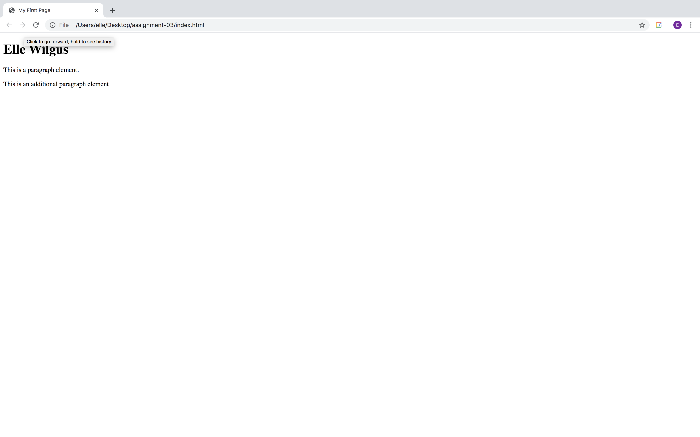

# Elle Wilgus

1. Web browsers interpret content and display what the client sees on the page. The browsers that I use are Safari and Google Chrome.
2. A markup language dictates the architecture and content of the page. HTML is the most well-known internet language and is commonly used in development.
3. 
