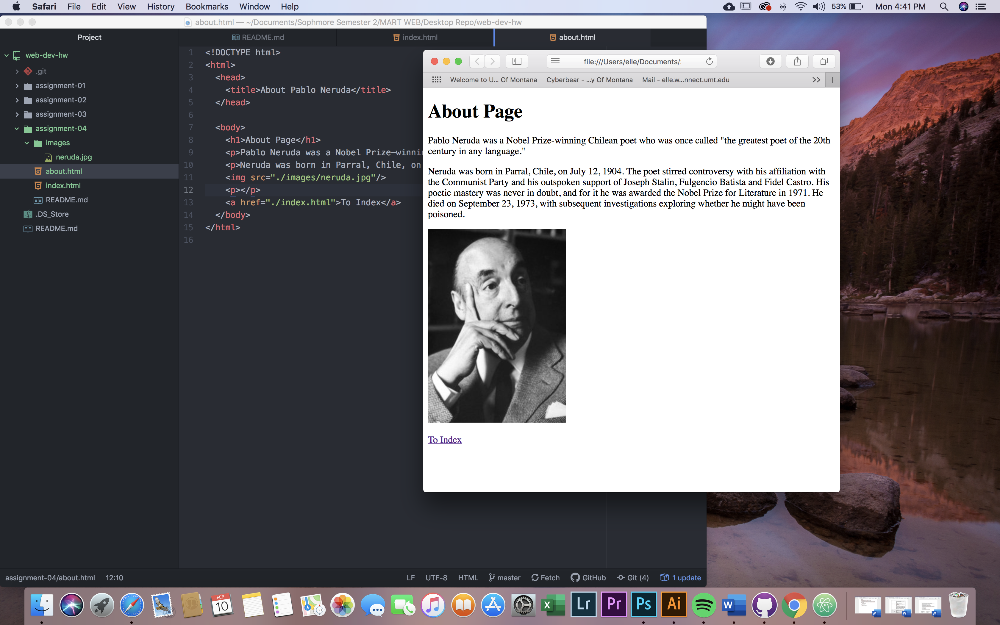

# Elle Wilgus
## Assignment 4

1. On The Wayback Machine, I visited the National Park Service website. I found a snapshot as early as 1997, but the version I decided to look closer at was from 2007. The website from 2007 looks very outdated but also has many of the features included in the current website. The current website of the National Park Service is much cleaner looking and displays icons and links much more affectively.
2. My experience with the GIT Module has been pleasant. I feel as though the addition of the GitHub Desktop application has streamlined the process of uploading from my computer to the GitHub website. As of now, the only thing I am finding difficult is remembering all the tags for writing in html, but taking notes has helped with that. Everything else seems to be going well.
3. 
